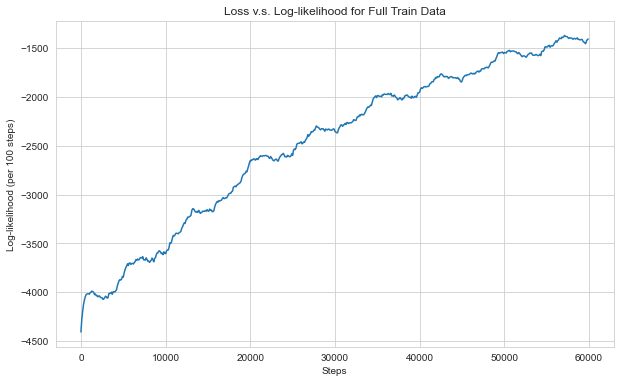
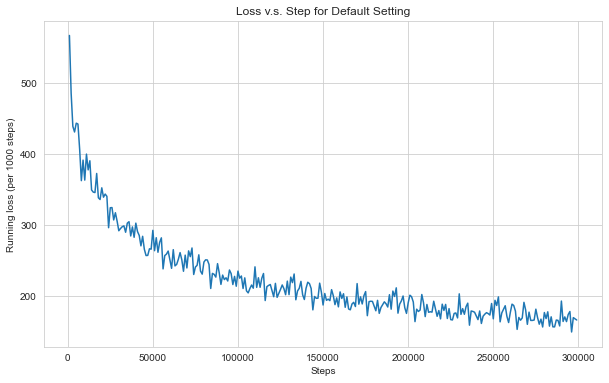
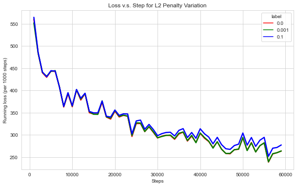
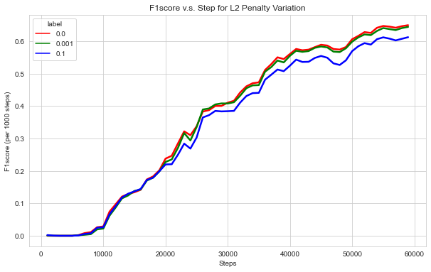
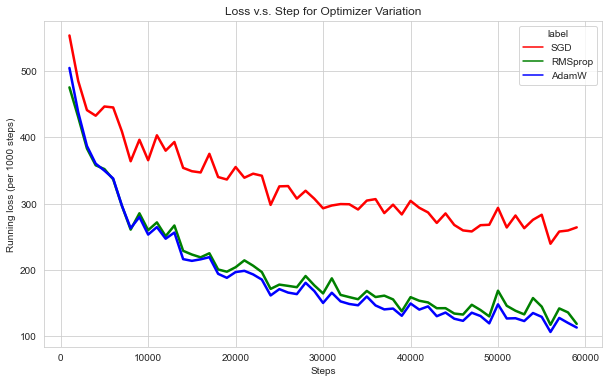
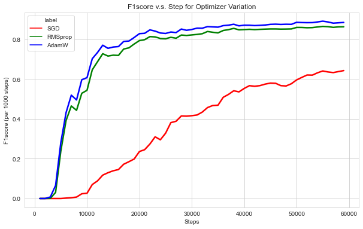
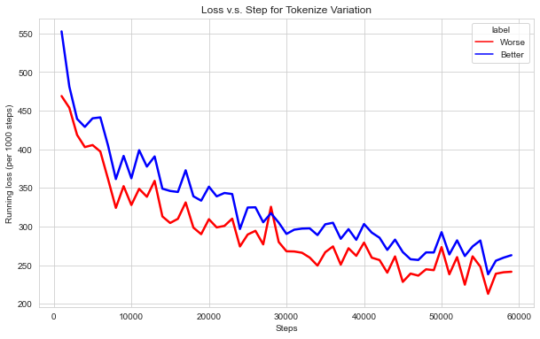
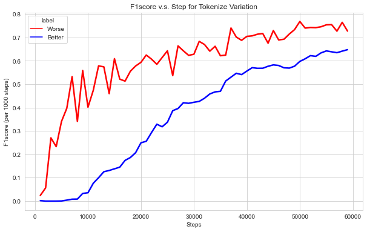
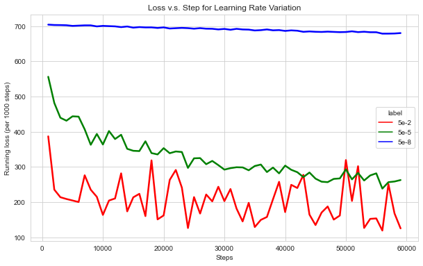
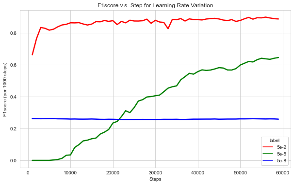

# SI630 Assignment1 Report

Name: Junqi Chen

Uniqname: junqich

UMID: 03846505

**Kaggle username: junqichen**

---

## Part 1: Representing Text Data

### Task 1.1: Tokenization

In the `tokenize()` method, I simply split the email by space without performing any other operations;

In the optimized `better_tokenize()` method, I make modification to fix the following issues (described in <**modification**: fixed issue> ):

+ **Lower all capital letters**: treat "Good" and "good" as same feature.
+ **Remove punctuations**: the feature will not include punctuations.
+ **Remove hidden information in <>**: avoid the unnecessary information from hidden organization or people's name
+ **Remove stopwords**: reduce the interference from useless stopwords.

I did all these modification to extract only the most efficient (I think) feature from the email text.


## Part 2: Logistic Regression in `numpy`

### Task 2.1: Plot log-likelihood



According to plot of log-likelihood v.s. step, we can clearly see that the model does not necessarily converge to some point even though the running loss has a stable increasing trend. To see whether if it converges to some point, we may need further training (for example, more epochs).

### Task 2.2: Make prediction on validation dataset

After training on the `test` data for a 600,000 number of steps (about 10 epochs), we make prediction on the `dev` validation data and get a F1score by `f1_score(y_test, y_pred)`. The result is 
$$
\text{F1 Score (on validation data)} = 0.8558190242572907
$$


## Part 3: Logistic Regression with PyTorch

Here are the answer for *Section 7.4 Training and Experiments*. I personally divide them into several tasks.

In this part, I train the model with the following default settings (*except for particular mentions, these parameters apply to the following tasks*):

```python
def TrainModel(X = train_mat_torch_dense, y = y_train, \
               num_epoch = 1, num_step = len(train_mat_torch), \
               opt_choice = 1, learning_rate = 5e-5, l2penalty = 0, \
               isloss = False, isf1score = False):
```

### Task 3.1: Compute loss and F1score for 5 epochs

Once the model is verified to work correctly, I train the model for 5 epochs and get the following statistics:

+ **The loss every 1000 steps**:

  

+ **The F1 score of the model on the development data (after training for 5 epochs)**:
  $$
  \text{F1 Score of Original Model (on validation data)} = 0.8266100495399858
  $$

### Task 3.2: Compute loss and F1score for L2 penalty variations

In this task, I train the model for 1 epochs (*same for following tasks*) with different L2 penalty (`weight decay`) values and get the following statistics: (*For the following tasks, the sampling rate for the step is 1000, i.e. record loss and F1score per 1000 steps*)

+ **Loss**:

  

+ **F1 score**:

  

From the graphs above, we can see the fact that: For `l2panelty` = 0 and 0.001, the curves are almost overlapping. But for `l2panelty` = 0.1, it has a larger learning loss and a lower F1 score. So we can infer that the larger the L2 is, the slower will the model converge (at least for the interval $L2 \in [0, 0.1]$).

### Task 3.3: Compute loss and F1score for optimizer variations

In this task, I train the model with different optimizer (`SDG`, `RMSprop` and `AdamW`) and get the following statistics:

+ **Loss**:

  

+ **F1 score**:

  

From the graphs above, we can see that `SGD` has the slowest converge speed while the `AdamW` has the fastest one. We can infer that the `AdamW` will have a better performance at the current `learning_rate = 5e-5`. That's why it become my final choice of the best model.

### Task 3.4: Compute loss and F1score for tokenization variations

In this task, I train the model with different tokenize function (`tokenize()` and `better_tokenize()` mentioned above) and get the following statistics:

+ **Loss**:

  

+ **F1 score**:

  

From the graphs above, we can see that the model with "better" tokenize function `better_tokenize()` does not actually perform better than the other one. The simple `tokenize()` have either lower running loss and faster converge speed than `better_tokenize()`. The reason may lies in that the former one (`tokenize()`) has more features than the later one (`better_tokenize()`) even though some of the features may be not so "efficient"

In simple words, the tokenization make an influence on the number of features, which affects greatly on the overall model performance. In our experiment, the `tokenize()` has more features and leads to a better result (according to F1 score and loss).

### Task 3.5: Compute loss and F1score for learning rate variations

In this task, I train the model with different learning rates (`lr` = 5e-2, 5e-5 and 5e-8) and get the following statistics:

+ **Loss**:

  

+ **F1 score**:

  

From the graphs above, we can see that:

+ The smallest learning rate (`lr` = 5e-8) has a very slow converge speed, which seems like a vertical line in both graphs.
+ The median learning rate (`lr` = 5e-5) has a normal convergence speed as before.
+ The largest learning rate (`lr` = 5e-2) converge quickly. But for the running loss, it starts oscillating up and down. For F1 score, it converges quicker than the other two.

### Task 3.6: Make prediction on test dataset

The setting for my final best model is shown below (with the left parameters as default):

```python
best_model = TrainModel(num_epoch = 20, 
                        opt_choice = 3, 
                        learning_rate = 5e-5, 
                        l2penalty = 0)
```

And the F1 score on the validation dataset `dev` is 
$$
\text{F1 Score of Final Model (on validation data)} = 0.9259452411994785
$$
, which is obviously better than the `numpy` implementation.