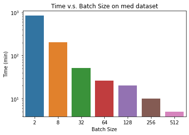
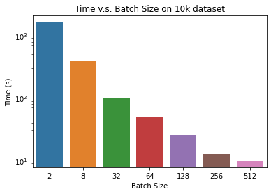
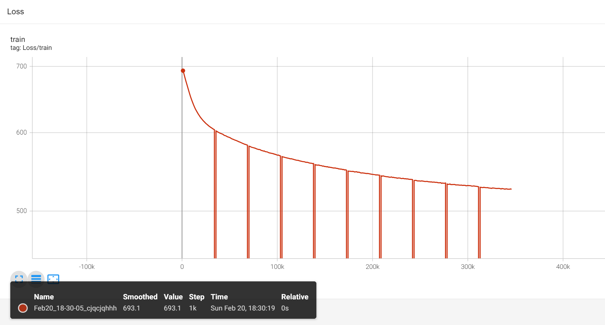

# SI630 Assignment2 Report

Name: Junqi Chen

Uniqname: junqich

UMID: 03846505

**CodaLab username: junqich**

---

## Problem 12

Here are graphs for the total estimated time v.s. batch size on different dataset (log scale for y-axis):

## Problem 13

I train the model for 10 epochs recording a running loss sum per 1000 steps. Here is the recorded tensorboard plot:

## Problem 15

*Answer for Problem 15 and Problem 16 are also included in the source code `Word2vec vector analysis.ipynb`.*

Here is the table for 10 targets word and their most similar words:

|      |    word     | most similar word |
| :--: | :---------: | :---------------: |
|  0   |    bread    |    vegetables     |
|  1   |   physics   |     chemistry     |
|  2   |  encourage  |      enhance      |
|  3   |   revenue   |        tax        |
|  4   |    covid    |     pandemic      |
|  5   |   genetic   |      protein      |
|  6   |  supernova  |      gently       |
|  7   |  oxidation  |      stucco       |
|  8   | serendipity |      weeting      |
|  9   | concession  |      debtors      |

From the table shown above (from the most common words to rare ones), we can find out the facts that:

+ For those commonly used words (0 - 6), we can easily figure out the relationship between the target word and its most similar word. For example, physics and chemistry are both categorized as natural sciences.

+ However, for those rare words, we can see that the model works not so well on them like connecting the oxidation with stucco. We can hardly figure out relationship in between. It may results from the lack of training examples.

(The whole list of similar words for each target word are shown for your reference)

## Problem 16

Here is the result for the getting analogy:

> sword - attack + defense = non
> jump - up + down = pistol
> water - liquid + solid = wide
> january - one + six = june
> earth - human + sun = devil

According to the five examples above, we can see that not all equations work the same as my thought (for the first 3 examples). For example, I orginally think that jump - up + down will lead to a "fall". However, it does not work. But for the last two examples, it makes sense in to some extent.

From my point of view, it is because the model is not trained well enough to explore the similarity in between. We may need more training data and further training to reach a better result.